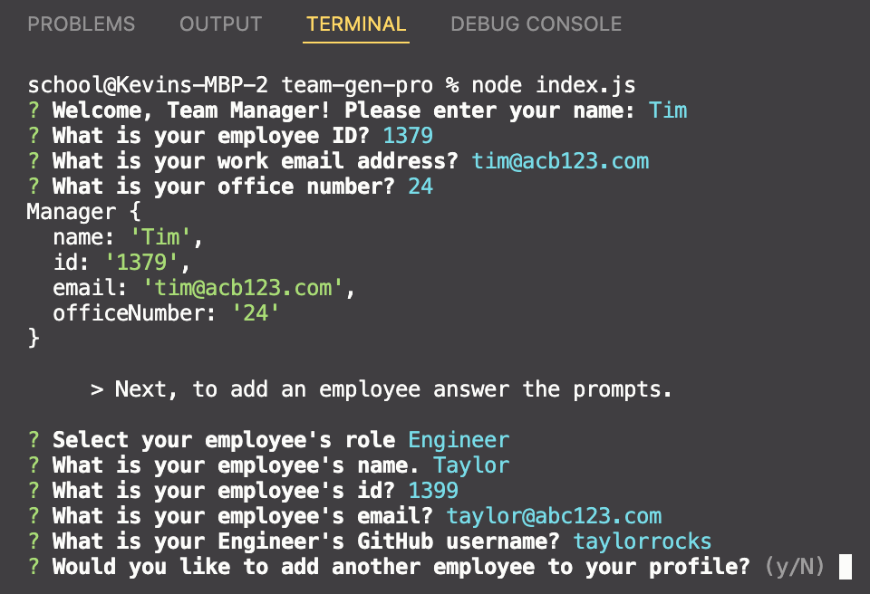

# Team Gen Pro
Team Generator Pro also known as *Team Gen Pro* is a command-line application that asks a series of questions to the Team Manager, such as what is your employee's role, and continues through a series of additional questions depending on the manager's choice, intern or engineer. 

Team Gen Pro generates a nicely formatted team roster based on a few questions. The team roster includes the engineer’s name, ID, email, and GitHub username.
The team roster includes the engineer’s name, ID, email, and GitHub username. This functionality is not currently present in the application.

## Get Started
- Clone this repo `git clone` 
- Open the application
- Run `node index.js`

## Video demos

[View intern entry demo >](https://drive.google.com/file/d/1eSY_gw_2LnO3CDk1M3Y9-Ri5-plE1KeL/view)
 
[View engineer entry demo >](https://drive.google.com/file/d/1ccBGZ-h6njx5me_BM2Q1xgGrSzx_OTKq/view)

## Screenshot
